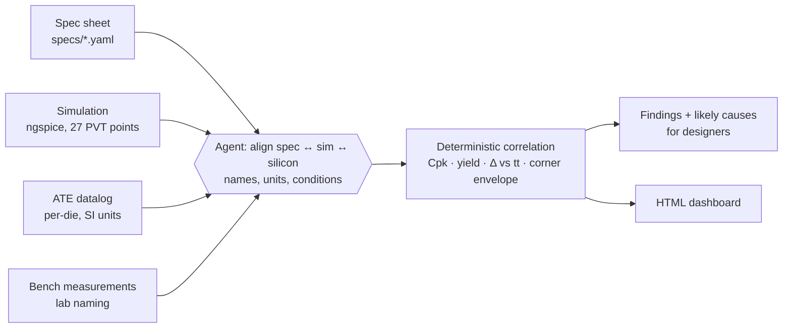

# spec2silicon

**An agentic flow that correlates analog specs, simulation corners and silicon measurements (ATE + bench), and flags discrepancies for the design team.**

It starts from a spec sheet, runs the circuit across process/voltage/temperature (PVT) corners, pulls in tester and lab data that use *different names and units* from the spec sheet, aligns everything, computes Cpk / yield / sim-vs-silicon deltas, and produces a dashboard plus findings with likely root causes.


## Why

In analog design, the spec, the simulation testbench, the ATE test program and the lab notebook are usually owned by different people and named differently (`Unity-gain bandwidth` vs `ugbw_hz` vs `OPA2S_GBW_CL5P[Hz]` vs `"GBW (scope)"`). Correlating them by hand is slow, and real sim-vs-silicon gaps get noticed late. This project automates that loop for a small example block.

## Flow



**Design principle: the LLM decides *what* to compare, code decides *whether it passes*.** The agent aligns names, picks the right source (ATE vs bench, primary vs secondary) and explains discrepancies; all numbers and pass/fail flags come from deterministic Python in `flow/core.py`.

## The example block

`OPA2S_01`: a two-stage Miller-compensated CMOS op-amp (NMOS input pair, PMOS mirror load, PMOS common-source second stage, nulling resistor + Miller cap, 5 pF load), simulated open-loop in ngspice with generic level-1 180 nm-class models in tt / ff / ss corners, −40 / 27 / 125 °C and 1.62 / 1.8 / 1.98 V.

| Spec | Limit | Measured on |
|---|---|---|
| Open-loop DC gain | ≥ 75 dB | ATE |
| Unity-gain bandwidth | 8–20 MHz | ATE |
| Phase margin | ≥ 55° | bench |
| Quiescent current | ≤ 85 µA | ATE (bench as cross-check) |

## What it finds (demo run)

| Spec | Sim tt | Silicon | Status | Why |
|---|---|---|---|---|
| DC gain | 84.4 dB | 83.5 dB | GREEN | correlates |
| GBW | 12.1 MHz | 9.4 MHz | RED | below the ss corner (−22 %), Cpk 1.16 → points to unmodelled parasitics at the compensation node |
| Phase margin | 65.0° | 55.6° | RED | 30 % of samples fail; below all corners → bench fixture/probe load not in the testbench |
| IQ | 70.2 µA | 70.3 µA | GREEN | ATE and bench agree |

It also reports silicon tests that have no spec (`OPA2S_VOS`, continuity) and specs with no silicon data.

## Run it

```bash
sudo apt install ngspice            # or brew install ngspice
pip install -r requirements.txt
python run_flow.py --offline        # rule-based alignment, no API key needed
export ANTHROPIC_API_KEY=...        # optional
python run_flow.py                  # Claude agent does the alignment and writes findings
```

Output: `reports/correlation_report.html` (self-contained dashboard) and `reports/correlation_report.json`.

## Repository layout

```
specs/opamp_spec.yaml           spec sheet (limits, units, verification method)
sim/netlists/                   op-amp testbench template + corner model files
flow/run_sims.py                PVT sweep with ngspice, parses .meas results
flow/make_silicon_data.py       synthetic ATE + bench data (see note below)
flow/core.py                    loading, unit conversion, correlation math, flags
flow/agent.py                   Claude tool-use agent + offline rule-based aligner
flow/report.py                  HTML dashboard
cadence/ocean_corner_sweep.ocn  sketch: how the sim stage maps to Virtuoso/Spectre
run_flow.py                     one-command entry point
```

## Flags

| Flag | Rule |
|---|---|
| `SPEC_FAIL` | < 99 % of silicon samples inside spec limits |
| `OUTSIDE_SIM_CORNERS` | silicon mean outside the ss–ff simulation range at the test conditions |
| `LOW_CPK` | Cpk < 1.33 |
| `LARGE_SIM_DELTA` | silicon mean differs from sim tt by > 10 % |

Comparisons are made at matched conditions (27 °C, 1.8 V), not against all corners.

## Honest limitations

- **Silicon data is synthetic.** It is generated from the typical simulation point with deliberate, realistic offsets (bandwidth loss from parasitics, phase-margin loss from probe load) so the flow has something to find. Real use would read STDF from the tester and the lab's exports.
- Models are generic level-1 MOSFETs, not a foundry PDK, and simulations are pre-layout.
- The Cadence stage is a sketch; this repo runs on open-source tools.

## Next steps

- Replace ngspice with Virtuoso ADE Assembler / Spectre via OCEAN or SKILL, reading specs from the ADE spec sheet
- Parse STDF directly (e.g. Semi-ATE STDF) and add wafer maps
- Correlate across temperature and supply, not only typical conditions
- Monte Carlo instead of corners for the simulated distribution, so Cpk can be compared sim vs silicon
- Open-source PDK (IHP SG13G2 or SkyWater sky130) and post-layout extraction
